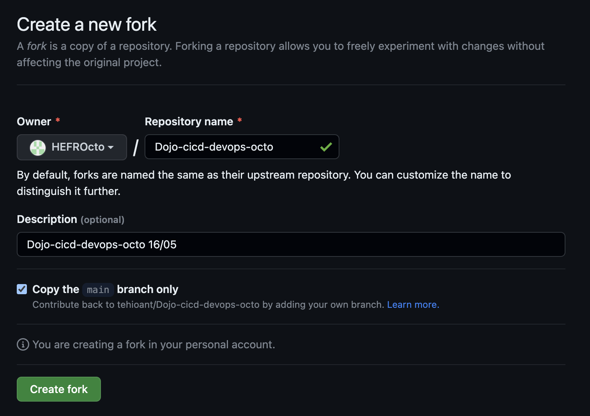

# Dojo CI/CD DevOps

## Introduction

This DOJO introduces skoolers hands-on to CI/CD using Gitlab and by deploying some Terraform infrastructure on Azure.

## Getting started

### Prerequisites

- **npm** installed on your computer.
- go installed
- Terraform installed.  (optional)
- Access to an Azure tenant. (optional)


## Set up

- Create a fork of the DOJO repository then clone your fork.
   1. You can rename the repository if necessary
   2. Select *copy the main branch only*
   3. Click created fork



- Install go and claat using the provided script `codelab-script.sh`.

```
git clone https://github.com/<your-name>/Dojo-cicd-devops-octo
cd Dojo-cicd-devops-octo
./codelab-script.sh
```


## Intructions

Follow instructions on codelabs.

```
cd instructions
claat export dojo.md
claat serve
```
Expected result:

```
$ claat export dojo.md
ok      dojo-cicd-codelab-markdown

$ claat serve
Serving codelabs on localhost:9090, opening browser tab now...
```
On your browser click on `dojo/` \
You can kill the running server as it is static.

## Authors and acknowledgment
This is a Dojo created for OCTO by Ante & Hefr.

## License
Using MIT License.

## Project status
Published

# Formateurs

## Deploy instructions

Attendies need to access the instructions.
Since we are using Codelabs, you need to create a storage account or any other way to deploy the Codelabs static site online.

If you wish to use Azure storage account, modify the Terraform files.
You can use the Makefile target to build and deploy your folder.

You can find help regarding Codelabs here: [Github link](https://github.com/googlecodelabs/tools)


## Tips

You should check if versions are up to date (Terraform, Typescript, ...).

## To Be Done

- Maybe provide a solution for the Dojo. Not a priority at the moment. 