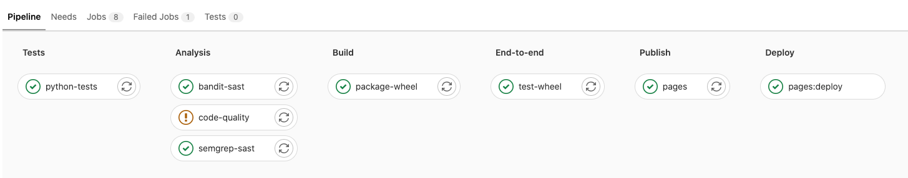
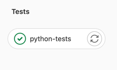
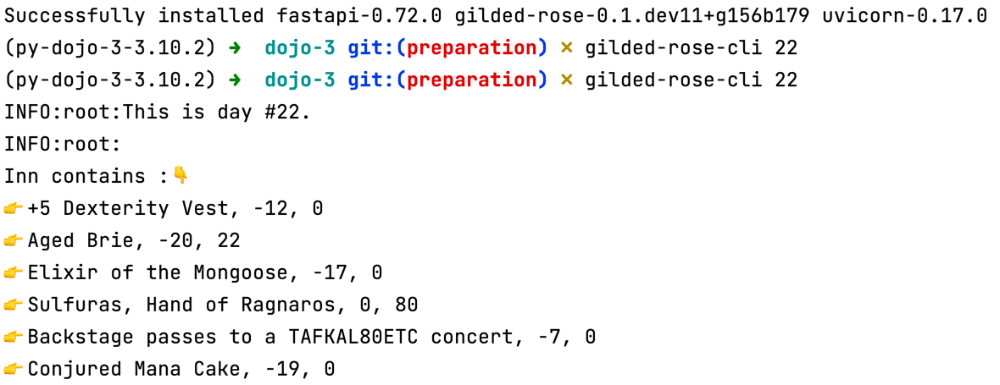
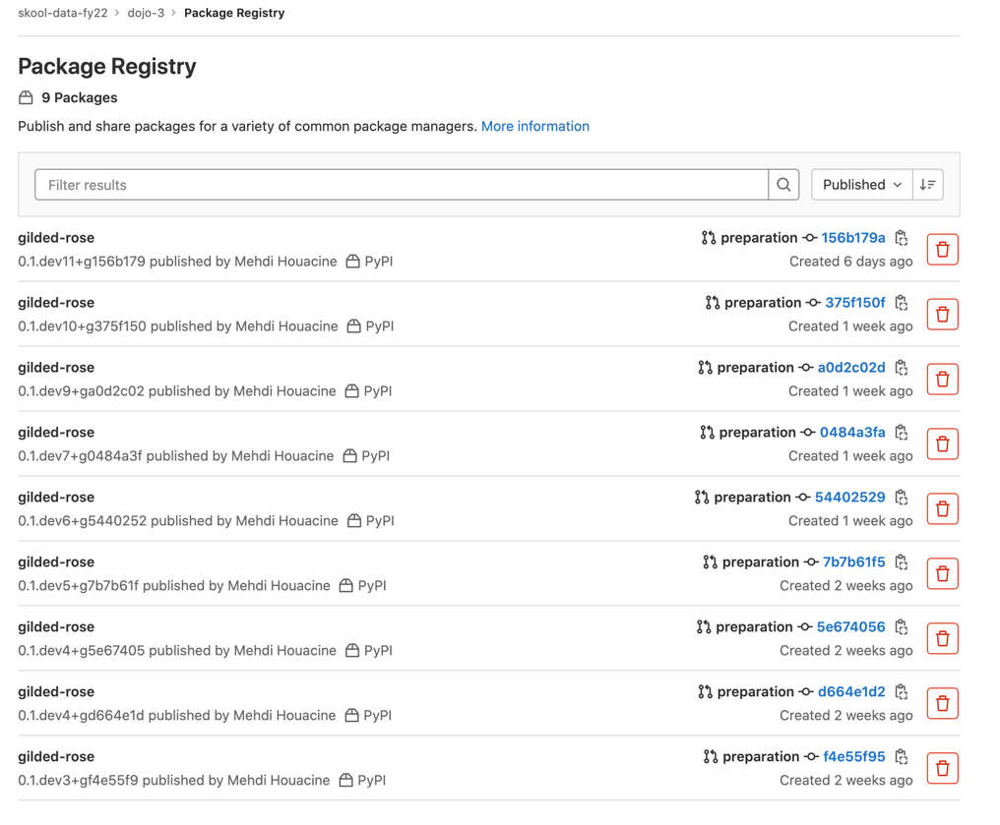

summary: dojo - intégration continue 
id: dojo 
categories: exercice 
tags: exercice 
status: Published 
authors: MHO
Feedback Link: https://gitlab.com/skool-data-fy22/dojo-3/-/issues/new

# Pipelines de CI

## Overview

Duration: 30

Objectifs pédagogique :

- Découvrir les concepts autour de l'intégration continue,
- Programmer un pipeline d'intégration continue/une usine de développement logiciel,
- Obtenir du feedback fréquemment grâce aux tests automatisés,
- Mesurer la qualité de son code,
- Automatiser la production d'artéfacts,
- Manipuler des registry d'artéfacts.

## Les concepts de l'intégration continue

Duration: 5

### Quelques slides pour démarrer

👉 [Dispo sur le drive OCTO](https://docs.google.com/presentation/d/1Sgs9ZuW2vG0EWFqxGvPRgzpNHMqoFk9-5da3MnIA8qQ/edit#slide=id.g804284dca3_0_176)
.

### Ce qu'il faut retenir

- Comme disait Martin Fowler sur son blog :

```text
Continuous Integration is a software development practice where members of a team 
integrate their work frequently, usually each person integrates at least daily, 
leading to multiple integrations per day.
```

Pour permettre cela et produire du code de qualité, il faut de l'automatisation et de l'outillage 🛠

Cet outillage, c'est généralement un pipeline, et on va en construire un pendant ce dojo 💃



Pour les curieux qui veulent aller + loin sur la notion d'intégration continue :

- <https://www.martinfowler.com/articles/continuousIntegration.html>
- <https://blog.octo.com/tag/continuous-integration/>

## TP 1 - Tests automatisés (local)

**🎯 Objectif** : je veux obtenir du feedback sur le produit que je développe via les tests

### Tests en local

```plaintext
> 🕵️‍ Automatiser, c'est rendre automatique une action qui était jusque-là manuelle 💪
```

**👉 Commencez par lancer les tests en local !** 

Au passage, prenez en note dans un fichier :
- les pré-requis : les commandes ou paquets que vous avez dû installer pour pouvoir lancer les tests,
- la commande que vous avez exécuter pour lancer les tests,
- le résultat attendu : logs affichés en console, fichiers de rapport produits, ...

🏁 Exemple de résultat attendu en lançant les tests en local avec 

```shell
$ PYTHONPATH=. pytest;
```


## TP 2 - Tests automatisés (CI)

**🎯 Objectif** : je veux obtenir du feedback sur mes tests à chaque commit poussé sur ma branche de travail.

**Rendu attendu à la fin de ce TP2** : en poussant du code sur ma branche de travail, un pipeline doit se lancer automatiquement sur gitlab. Ce pipeline doit permettre d'exécuter les tests avec pytest, comme ceci quand les tests sont au vert :



### Tests dans le pipeline de CI

👉 Editez le fichier [.gitlab-ci.yml](../.gitlab-ci.yml) afin d'y ajouter un stage nommé `python-tests`.

Ce stage contiendra 1 step nommée `Tests` qui doit exécuter les tests python rédigés avec `pytest`.

|                   a                    |                   b                   |
|:--------------------------------------:|:-------------------------------------:|
| ✅ Succès si tous les tests sont verts  | 🔴 Echec si au moins 1 test est rouge |
|         |  |

**🏁 Test de recette** : Si la step `python-tests` s'exécute bien dans votre pipeline de CI,
- elle devrait arborer une coche verte, 
  -  
- et afficher les logs d'exécution de la commande pytest en console.
  - 

ℹ️ Si vous ne savez pas comment faire éditer le pipeline, la partie ci-après vous donnera un premier vernis sur les pipelines gitlab-ci et leur déclaration en YAML.

#### 🦊 Un mot sur les pipelines Gitlab si vous n'avez jamais manipulé cet outil

`Gitlab CI/CD` est un outil mis à disposition par Gitlab pour construire des pipelines de traitement.

Ces pipelines peuvent être utilisés à des fins d'intégration continue.

Le pipeline est décrit au travers de code, dans un fichier [.gitlab-ci.yml](../../.gitlab-ci.yml), à la racine du repo en langage [`YAML`](https://learnxinyminutes.com/docs/fr-fr/yaml-fr/), une spec de configuration similaire au `JSON`.

La documentation de gitlab ainsi que les mot-clefs utilisables dans le fichier `.gitlab-ci.yml` sont consultables sur <https://docs.gitlab.com/ee/ci/yaml/README.html>.

#### 🐍 Un exemple de fichier .gitlab-ci.yml, décrit en Python

Un exemple officiel en Python est disponible sur le repository Gitlab de Gitlab: <https://gitlab.com/gitlab-org/gitlab/-/blob/master/lib/gitlab/ci/templates/Python.gitlab-ci.yml>, nous allons le décrire briévement ci-après:

```yaml
## Un exemple de fichier .gitlab-ci.yml

# Le pipeline va s'exécuter dans une image docker.
# En l'ocurrence, il s'agit de l'image python officielle
# la plus à jour dans le dockerhub: https://hub.docker.com/r/library/python/tags/
image: python:latest

# Il est possible de définir des variables d'environnement
# qui seront disponibles dans la suite du pipeline.
variables:
  PIP_CACHE_DIR: "$CI_PROJECT_DIR/.cache/pip"

# Déclaration des stages du pipeline dans lesquels les steps s'insèreront
stages:
  - tests
  - build

# Une step nommée "test" est au stage nommé "tests" 
test:
  stage: tests
  script:
    - python setup.py test
    - pip install tox flake8  # you can also use tox
    - tox -e py36,flake8

# Une step nommé "packaging" est ajoutée au stage nommé "build".
# Elle s'exécutera si l'étape "test" se termine avec succès.
packaging:
  stage: build 
  dependencies: ["code-quality"]
  script:
    - python setup.py bdist_wheel
  # La direction "artifacts" permet de sauvegarder
  # des objets construits lors de l'exécution du pipeline.
  artifacts:
    paths:
      - dist/*.whl
```

## TP 3 (bonus)

```plaintext
⚠️ Si vous vous sentez en retard; laissez de coté ce bonus; 
Vous pourrez y revenir plus tard 📅 🎱 🔮
```

1. Dans la step `python-tests`, faites en sorte que la commande `pytest` calcule la couverture de tests sur le module `gilded_rose` et produise la mesure de couverture en console.
   1. Vous pouvez utiliser [le package pytest-cov](https://pytest-cov.readthedocs.io/en/latest/readme.html#installation) pour y arriver.
2. Faites en sorte que la commande `pytest` calcule la couverture de tests sur le module `gilded_rose` et produise les mesures dans un rapport au format HTML.
   1. pytest-cov permet de générer des rapports, [consulter la documentation](https://pytest-cov.readthedocs.io/en/latest/reporting.html) pour voir comment faire ça.
3. Changez la destination de production de ces rapports afin de les produire dans un dossier [reports/pytest/](../reports/pytest) à la racine du repo.
4. Rendez les rapports du dossier `reports/` accessibles sous la forme d'artéfacts. 
   1. Un exemple d'utilisation de [la fonctionnalité d'artéfact](https://docs.gitlab.com/ee/ci/pipelines/job_artifacts.html) est consultable dans l'extrait de fichier yml du TP précédent (partie _🐍 Exemple décrit en Python_)

**🏁 Test de recette : les rapports sont disponibles dans gitlab-ci, via le bouton `Browse`, comme suit à droite :**


👉 Le bouton `Browse` devrait vous permettre de consulter les rapports HTML que vous avez produit dans la step `python-tests` :


## TP 4 : Mesure de la qualité du code (local)

```plaintext
🎯 Objectif : je veux obtenir du feedback sur la qualité du code sur commande.
```

👨‍👨‍👧‍👦 La qualité du code, c'est une notion subjective qui se définit généralement en équipe.
📊 Une fois qu'on l'a défini collectivement, on peut définir des indicateurs pour la mesurer.
📦 Certains package Python peuvent produire de tels indicateurs. 

**Par exemple :**

- [flake8](https://github.com/PyCQA/flake8) est un linter de code Python sur le style. Le nombre de warnings peut donner une indication de
la _compliance_ du code que l'on a produit avec les standards de style reconnus dans 
l'écosystème Python.
👉 On pourrait définir que du code de qualité, c'est du code qui respecte ces standards et dont
le nombre de warning tend vers 0.

- [mypy](http://mypy-lang.org/) est un linter de code Python sur le _type hinting_. Le nombre de warnings levés donne une indication sur
le nombre de fonctions où 
  - le type hinting manque,
  - le type hinting est présent mais erroné,
  - etc ...
👉 On pourrait définir que du code de qualité, c'est du code où 
le type hinting est utilisé systématiquement pour documenter le type de chaque argument 
et le type de la valeur de retour attendue. Donc du code où le nombre de warnings tend vers 0.

- [pytest-cov](https://github.com/pytest-dev/pytest-cov) est un plugin de pytest qui permet de profiter l'exécution des tests pour 
mesurer la couverture du code par les tests, c-a-d le ratio du nombre de lignes de code source traversé par les tests sur le nombre de lignes de code total.
👉 On pourrait définir que du code de qualité, c'est du code où chaque ligne est testée, 
donc du code où le code coverage tend vers 100% (ou du moins dépasse un seuil élevé, ex: 80%).

👉 Insérez vos métriques favorites ici pour mesurer la qualité du code ou auditer du code 🤓
- Respect des ratios de la pyramide de tests,
- Respect de la clean architecture,
- Absence de code mort,
- Nombre de bugs,
- Seuil de complexité cyclomatique,
- Métriques de sécurité (nombre de failles/CVE dans le code ou les dépendances),
- Métriques Accelerate (Lead time, MTTR, ...),
- ... 

🏁 **Objectifs :**

```plaintext
> 🕵️‍ Automatiser, c'est rendre automatique une action qui était jusque-là manuelle 💪
```

👉 Commencez par essayer de mesurer la qualité du code en local ! 

Sur votre poste local, installez les outils suivant, mesurez la qualité de votre code en ligne de commande et affichez les résultats de mesure en console avec :
- flake8
- mypy
- pytest-cov
- safety
- bandit

🎯 Mesurez les indicateurs suivant sur vos postes, en local :

- Nombre de warnings sur le style du code avec flake8,
- Nombre de warnings sur le type hinting avec flake8,
- Faites des analyses de sécurité avec bandit et safety,
- Mesurer la compléxité du code avec Pylama

Comme précédemment, prenez en note :
- les pré-requis : les commandes ou paquets que vous avez dû installer pour pouvoir lancer les tests,
- la commande que vous avez exécuter pour lancer les tests,
- le résultat attendu : logs affichés en console, fichiers de rapport produits, ...

Cela nous servira pour reproduire cela dans notre pipeline de CI dans le prochain exercice.

Des exemples de sorties console sont disponibles dans le fichier [instructions/docs/analysis.txt](../docs/analysis.txt)

## TP 5 : Mesure de la qualité du code (CI)

```plaintext
🎯 Objectif : je veux obtenir du feedback sur la qualité du code automatiquement à chaque push d'un commit.
```

Le pipeline doit permettre 
- d'éxécuter les tests avec pytest, 
- puis si les tests sont verts; exécuter les étapes de mesure la qualité du code dans un stage `code-quality` comme ceci :


- ✅ Le stage `code-quality` sera vert si votre base de code respecte les standards de flake8, mypy, pytest-cov, safety, bandit
- 🔴 Le stage `code-quality` sera rouge si l'un de ces outils d'analyse relève au moins 1 warning.

### Autoriser l'échec d'une step

Dans le TP suivant, nous allons ajouter une step supplémentaire au pipeline pour packager automatiquement l'application 
- si les tests sont verts,
- et si le code produit est "de qualité suffisante".

En l'état, le code Python n'est pas "parfait" concernant les outils d'analyse que nous utilisons : il y a quelques warnings notables avec mypy et flake8 par exemple.

S'il est utile de savoir que ces warnings existent, et qu'il faudra les corriger, nous ne souhaitons pas pour autant que le pipeline de CI s'arrête sur cette étape `code-quality`.

Pour permettre au pipeline de continuer, gitlab propose la fonctionnalité [allow-failure](https://docs.gitlab.com/ee/ci/yaml/#allow_failure).

🏁 **Objectif : utilisez la fonctionnalité _allow failure_ sur le stage `code-quality` pour permettre au pipeline de ne pas s'arrêter même s'il échoue sur celui-ci.**

**Rendu attendu** :

- ✅ Le stage `code-quality` sera vert si votre base de code respecte les standards de flake8, mypy, pytest-cov, safety, bandit
- ⚠️ Le stage `code-quality` sera orange si l'un de ces outils d'analyse relève au moins 1 warning.

- 

## TP 6 : Packager du code de qualité (local)

```plaintext
🎯 Objectif : je veux packager du code automatiquement.
```

Dans le dojo précédent (rappelez-vous, c'était il y a 1 mois 👴), on avait packagé notre application Python au format Wheel avec setuptools, et les commandes suivantes :

```shell
cd dojo-3;
pip install wheel;
python -m build --wheel; ️
```
🏁 **Objectif 1 : Packagez l'application en local au format Wheel.**

🍜 Test de recette : un fichier au format .whl devrait être apparu dans le dossier dist/ ❗️

🏁 **Objectif 2 : Changez la version de l'application en 1.18.27 avant de la packager.**

🍜 Test de recette : un fichier gilded_rose-1.18.27-py3-none-any.whl devrait être apparu dans le dossier dist/ ❗️

ℹ️ Indice : un attribut `version` est défini dans le fichier setup.cfg. Vous ne devez pas le modifier, mais ça devrait vous mettre sur la piste.

🏁 **Objectif 3 : Produisez une version unique de l'application automatiquement avec le package setuptools_scm.**

De la documentation sur ce package est disponible ici : <https://pypi.org/project/setuptools-scm/>

🍜 Test de recette : un fichier au nom ressemblant à gilded_rose-0.1.dev5+g7b7b61f.d20220209-py3-none-any.whl devrait être apparu dans le dossier dist/ ❗️

## TP 7 : Packager du code de qualité (en CI)

```plaintext
🎯 Objectif : je veux packager du code automatiquement à chaque push d'un commit, si et seulement si les tests passent et la qualité du code est acceptable.
```

Le pipeline doit permettre 
- d'éxécuter les tests avec pytest, 
- puis si les tests sont verts : exécuter les étapes de mesure la qualité du code dans un stage `code-quality`
- puis si les tests sont verts et la qualité OK : packager le code au format wheel avec une version unique.

🏁 **Objectif 1 : Packagez l'application en local au format Wheel.**

🍜 Test de recette : une nouvelle step `package-wheel` un nouveau stage `build` dans le pipeline de CI doit permettre de produire un fichier au format .whl comme ceci : 


️🏁 **Objectif 2 : Rendre le package accessible en artéfact.**

🍜 Test de recette : la step `package-wheel` doit exposer le contenu du dossier dist/ en artéfact afin de rendre le fichier .whl téléchargeable depuis l'interface web : 


️🏁 **Objectif 3 : Testez le wheel en local via les artéfacts**

🍜 Test de recette : le wheel téléchargé via l'interface web et installé localement avec pip fonctionne comme suit : 



️🏁 **Objectif 4 : Stocker le package dans une registry PyPI privé sur gitlab**

Gitlab met à disposition une registry PyPI par repository de code pour y entreposer les wheel produit automatiquement par la CI.

[En suivant la documentation](https://docs.gitlab.com/ee/user/packages/pypi_repository/#authenticate-with-a-ci-job-token) dans la partie `Authenticate with a CI job token`, 
modifiez la step `package-wheel` pour pousser le fichier .whl produit dans la registry PyPI du repository.

🍜 Test de recette : le wheel produit par la step `package-wheel` est disponible dans la registry PyPI du repo : 



️🏁 **Objectif 5 (bonus) : Testez votre wheel, déposé dans la registry, après l'avoir installé en local avec pip install**
